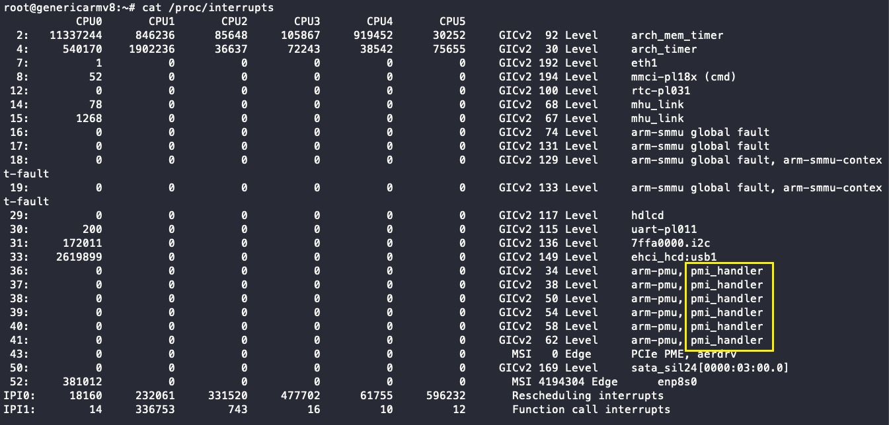
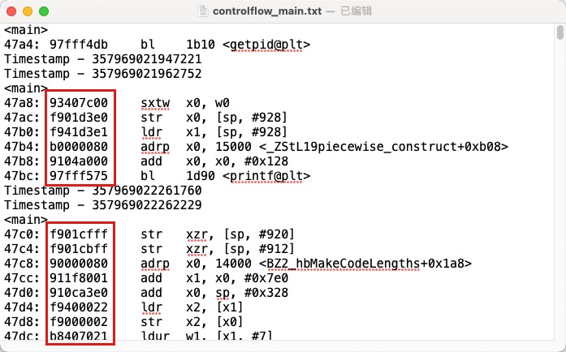
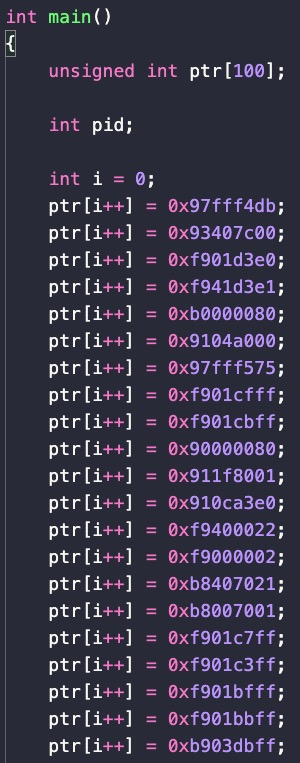

# Secrecy Escrow

## What is it?

- A Safe for the Blockchain
- Like a bank, where user can keep their secrect document (will for example)


---

## Why we need it?

- Everything on Blockchain is public.

    - Transaction
    - Amount of assets
    - Contract call parameters

- We need to keep something in secrect (for a certain period of time).
        
    - Answer of a question
    - Last words
    - Moves of a game player
    - Time capsule
    - Secret documents
---

## Why Automata?

- It is hard to keep data secrect in a public system
- We need a decryption key management mechanism
- The decryption key should not be controlled by or known to anyone
- Automata has TEE to provide isolated environment

---

# Account Escrow

## What is it?

- User empower Automata to control their account by giving or creating private key in Automata
- Making Automata more like a centrolized service provider
- Or deposit token to Automata owned account

## How we gonna use it?
- Allowing automata to insert special values into the Transaction
    - Random number
    - Decrypted secrecy 
- Allowing Automata to trigger smart contract when special even occurs
    - Delayed contract state update
    - Recursive contract state update
    - Contract state update on special event (date, block height).

## Why Automata?

- Automata is a middlewire, it monitor the Blockchain state all the time
- TEE ensures that Automata will not abuse the user token


<!-- 
## Library Hook: Importance, Challenges, Solutions

Challenge:

- Impractical to neglect the library, due to the tremendous size of ETM result
- Preloading every functions is ugly (*but might be acceptable for specific functions*)
- Need to distinguish deterministic functions (e.g., `sqrt` 100M times needs less than 1s)
- Some Challenges in watchpoints...
    - A function can write a memory region for many times...
    - How to handle `void*****`
    - But the watchpoint still din't run successfully

Some other thoughts:

- Need further study on librarys
- Multi-layer structure: complicated optimization only for most common cases

---

## Some ... Other Responsibilities

- I was assigned to RISCV-TEE Group
    - I am a person focused in Arm, why suddenly appointed to RISCV?
    - But Zhenyu told me: the boss has studied and decided
- Schedule for next period:
    - Work with Mingde, depoly their work on our new board
    - Migrate berkeley boot loader to openBSI + uboot 


# Wenxuan

---

## Plan

Due to our meeting, I have two main targets:

1. using PMI to help collect ETM log periodicly.
2. Implement a Replay Machine for online tracing stage.

---

## Interrupt handler in kernel

Much easier than register a interrupt handler in ATF.

```c
unsigned long irq_flags = IRQF_PERCPU 
                 | IRQF_NOBALANCING 
                 | IRQF_NO_THREAD 
                 | IRQF_SHARED;
request_irq(irq_id, pmu_irq_handler, 
            irq_flags, "pmi_handler", 
            (void*)pmu_irq_handler);
```

---

## Tips on handle interrupt in kernel

### Interrupt Mapping
- Interrupt ID in kernel (logic interrupt ID) is different from the hardware interrupt ID.
- Logic interrupt ID is not always adding a simple offset.
- Linux kernel remains logic interrupt ID 36, 37, 38, 39, 40, 41 for PMU in Juno board r2.

### Exclusive Handler
- Normally an interrupt can only have one handler.
- Unless that irq_flag contains `IRQF_SHARED`.

---

## Register a co-existing handler 

After everything is set up, our kernel module successfully handles PMI.



---

## One more question: why use interrupt mapping?

- Interrupt Controller => IRQ Chip => Multi-level Interrupt Controller
- multi IRQ Domain (where IRQ handler takes effect)
 
### Mapping Models

- Linear Mapping. `irq_domain_add_linear()`, map similar interrupts together. (e.g. our Arm PMI)
- Radix Tree Mapping. `irq_domain_add_tree()`, use hardware id as lookup key in the radix tree. (e.g. MIPS hardware)

---

## Replay Machine

Since we got a ridiculous score from the professor ...

### Experiment

Replay a simple binary with no *non-deterministic* factors.

---

## Experiment

This is the control flow we reconstructed before.



---

## Construct

- disassemble
- use ETM output to locate code blocks
- collect "waterfall" control flow

We consider the "waterfall" control flow unacceptably large. We are going to construct a block dynamically.


## Re-Execute

::: columns

:::: column



::::

:::: column

. . .

Segmentation fault.

### Registers
- The initial state of registers are different.
- Store and restore registers (user space context switch).

### Sections
- Origin data, bss memory section are not copied.
- Copy static memory sections like data and bss.

::::

:::

---

## Next Week's Plan

- Store and restore registers
- Final Exam :(

# Xueying

---

## Last week's plan

Replay machine

---

## This week's work

take final exams.

---

## Next week's plan

Replay machine -->
