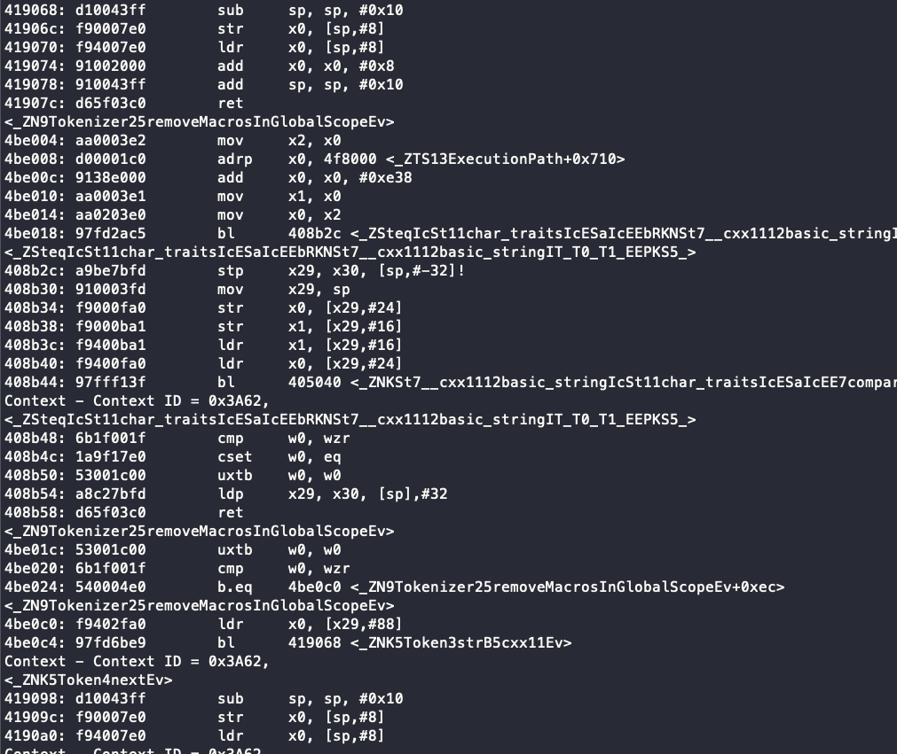
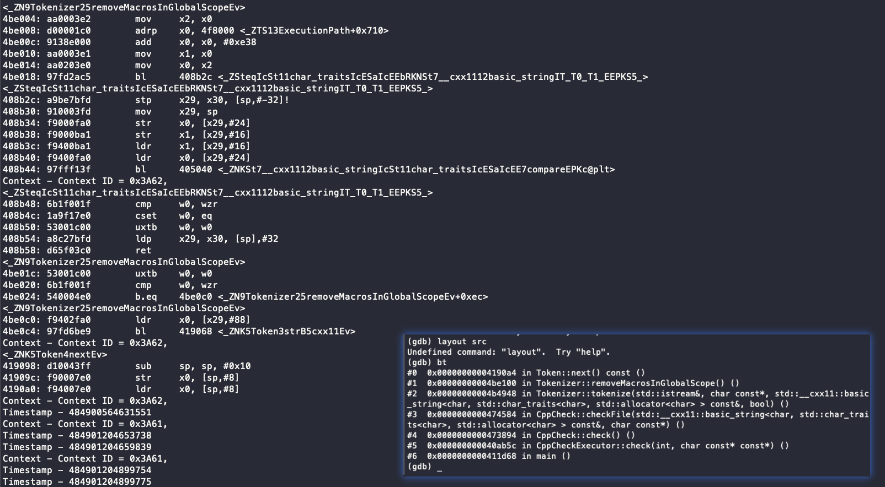

# Haonan

## Plan of Last Week

- **Really** finish my syscall capturing
- Paper writing: overview and design

---


## Actual Progress

- finish my syscall capturing (On Apr. 8)
- \sout{Paper writing: overview and design}
  - Academic garbage: overview and design

### Zhenyu quotes
I have foreseen that I will spend a lot of energy to help you revise it

---

## Bug Investigation: the existence of `printk`

```c
char syscall_id_to_name[][32] = { "io_setup", ... };
sprintf(small_buf,
        "pid=%d, %s, ret=0x%lx, name=%s\n",
        current->pid, syscall_id_to_name[syscall_no],
        res, current->comm);
printk("%s",small_buf);
```
\centering
  \textbf{normal run}\par

```c
char syscall_id_to_name[][32] = ...
sprintf(...)
// printk("%s",small_buf);
```
\centering
  \textbf{crash!}\par

---

## Bug Investigation: index out of range

- Comment each part of code above, to produce bug
- we find the root cause is `syscall_id_to_name[syscall_no]` may out of range
- I save `syscall_no` in the hash table. To prevent \textit{null pointer deference}, I check its value.
```c
    record = hashtable_get(&hash_table, current->pid);
    if (record)
      syscall_no = record->no;
```
- For syscalls entered but not exited before we load, there is no entry in our hashtable.

---
## Handle different syscalls

For example `deafult` to handle all unregistered syscalls:

\small
```c
inline int default_handle(char* small_buf, struct pt_regs* regs,
                          unsigned long syscall_no, long ret,
                          unsigned long arg0) {
  sprintf(small_buf, "pid=%d, %s, res=%ld\n", current->pid,
          get_syscall_name(syscall_no), ret);
  return 0;
}
```

Register handlers:

\small
```c
handler_callback functions[] = {
    &getuid_handle, &recvfrom_handle, ...
};
char handler_string[][32] = {
    "getuid", "recvfrom", ...
};
```

---

## More Performance Test 

- Result: ~1%
- test 50 groups (unit: seconds)

|             | **baseline** | **our**      |
| ----------- | ------------ | ---------------- |
| **1**       | 144.139      | 137.249          |
| **2**       | 133.001      | 135.170          |
| ...      | ...     | ...         |
| **46**      | 139.766      | 142.664          |
| **47**      | 141.629      | 144.294          |
| **48**      | 132.655      | 139.153          |
| **49**      | 141.153      | 156.555          |
| **50**      | 138.816      | 140.288          |
| **avg**     | 139.21458    | 140.5195         |
| **ratio** |              | 1.00937344349996 |

---

## Plan for Next Week

- Complete drafts of \textbf{all parts of} the paper

# Xueying

---

## Plan of Last Week

- help to write code

---

## This Week's Work

- Build the environment of ETM with the help with Yiming
- try ptrace() but failed.
  - pt_regs VS. user_pt_regs
  - PTRACE_ATTACH failed with unknowable reason
  - Use child process: find PC value failed. Find data failed.
- Many programs can be found that use ptrace() for code injection, but most of them are implemented under x86.


# Wenxuan

---

## Last week's plan

- [x] (Paper writing) Trace three buggy programs, and analyse the output.

- [ ] \color{gray} (Replay Machine) Decode coredump and extract useful memory layout. Use `ptrace` to restore the memory layout in a new process.

---

## Evaluation: Non-concurrency Bugs

Using our framework to analyse three typical non-concurrency bugs.

### Unhandled Input Pattern

[github/bugbase/cppcheck-148](https://github.com/HiiragiKano/bugbase/tree/master/data/cppcheck-148)

[github/bugbase/curl-721](https://github.com/HiiragiKano/bugbase/tree/master/data/curl-721)


### NULL pointer access

[github/bugbase/cppcheck-152](https://github.com/HiiragiKano/bugbase/tree/master/data/cppcheck-152)


---

## Tricks using ETM

Normally when we want to set ETM to trace a program, we give it the context id (pid). However, the buggy program crashes very quickly. Thus, we need to appoint the pid to ETM first, and **execute** the program with the pid.

---

## Tricks using ETM

Set ETM to trace a program with certain **context id (pid)**.

```c
#include <stdio.h>
#include <unistd.h>
int main(int argc, char *argv[]) {
    pid_t pid = fork();
    if (pid != 0) {
        // main
        printf("Process running at %d\n", pid);
        wait(NULL);
    } else {
        // child process
        printf("Press ENTER to run '%s'", argv[1]);
        getchar();
        execvp(argv[1] , &argv[1]);
    }
}
```

---

## Tricks using ETM

**Set ETM** to trace a program with certain context id (pid).

\tiny
```bash
echo -n "Please enter context ID: "
read ctxid
echo 0 >/sys/bus/coresight/devices/etm0/enable_source 
echo 1 > /sys/bus/coresight/devices/tmc_etr0/enable_sink 
echo 0x10000000 >/sys/bus/coresight/devices/tmc_etr0/buffer_size
echo 0x4c000850 >/sys/bus/coresight/devices/etm0/mode
echo 0 >/sys/bus/coresight/devices/etm0/addr_idx
echo 0x400000 0x402000 0 >/sys/bus/coresight/devices/etm0/addr_range
echo 0x101 >/sys/bus/coresight/devices/etm0/bb_ctrl
echo 0 >/sys/bus/coresight/devices/etm0/ctxid_idx
echo 0x6F49>/sys/bus/coresight/devices/etm0/ctxid_pid
echo $ctxid >/sys/bus/coresight/devices/etm0/addr_ctxtype 
echo 0 >/sys/bus/coresight/devices/etm0/cntr_idx
echo 0 >/sys/bus/coresight/devices/etm0/cntr_ctrl
echo 0 >/sys/bus/coresight/devices/etm0/cntrldvr
echo 2 >/sys/bus/coresight/devices/etm0/res_idx
echo 0x20001 > /sys/bus/coresight/devices/etm0/res_ctrl
echo 0x2 > /sys/bus/coresight/devices/etm0/event_ts
echo 1 >/sys/bus/coresight/devices/etm0/enable_source
echo -n "Press ENTER to stop tracing"
read something
dd if=/dev/tmc_etr0 of=/home/root/trace/etmtrace
echo 0 >/sys/bus/coresight/devices/etm0/enable_source
```

---

## Control Flow (cppcheck-148)



---

## Control Flow: Find bugs

Compare to GDB: same call stack, more detailed instructions.




---

## Find bugs

Compare the control flow with the source code, locate the problem.

\tiny
```
<_ZN9Tokenizer25removeMacrosInGlobalScopeEv>
4be0c0: f9402fa0        ldr     x0, [x29,#88]
4be0c4: 97fd6be9        bl      419068 <_ZNK5Token3strB5cxx11Ev>
Context - Context ID = 0x3A62,
<_ZNK5Token4nextEv>
419098: d10043ff        sub     sp, sp, #0x10
41909c: f90007e0        str     x0, [sp,#8]
4190a0: f94007e0        ldr     x0, [sp,#8]
```

\tiny
```cpp
void Tokenizer::removeMacrosInGlobalScope()
{
    for (Token *tok = _tokens; tok; tok = tok->next())
    {
        if (tok->str() == "(")
        {
            tok = tok->link();
            if (Token::Match(tok, ") %type% {") && tok->strAt(1) != "const")
                tok->deleteNext();
        }

        if (tok->str() == "{")
            tok = tok->link();
    }
}
```

---

## Control Flow: Find bugs

If we can find a stable analysis model, we can use the framework to detect many other bugs.

But currently, the result is strong enough to make the claim that "the prototype can be used to locate non-concurrency bugs".


\color{gray}(Advantage?) Compare to GDB: same call stack, more detailed instructions.

---

## Next week's plan

- [ ] Writing the non-concurrency evaluation part
- [ ] Help writing other parts