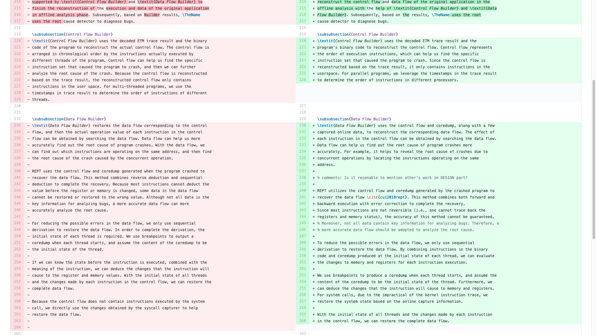

# Haonan

## Plan of Last Week

- Syscall capturing: how to handle the content of `read`
- Paper writing: revise & rewrite

---

## Problem

- `read` syscall: \newline
  `ssize_t read(int fd, void *buf, size_t count);`
  - `fd`: the *file descriptor*
  - `buf` with `count` length: read from `fd` with `count` length to `buf`
  - return the actual length read to `buf`
- original version: only record the `return value` and the `fd`
- record `buf` \[Option 1\]: record the whole `buf` (may incur considerable overhead)
- record `buf` \[Option 2\]: truncate the `buf`, only first 256 bytes.

---

## Pressure Test


```c
  int main(){
	  freopen("record","r",stdin);
	  int cnt = 0;
	  while(scanf("%s",buf) != -1){
		  cnt++;
	  }
	  printf("%d\n",cnt);
  }
```

- file `record`: a huge file (2GB), *generated by 100 min of syscall capturing*
- 493,437 `reads`
- typically, the count of `read` is `4096/8192` bytes (for `scanf`, `4096` bytes) \newline
  *though* `read` *support* `0x7ffff000` *bytes*

---

## Performance Test: Read Huge file
perform well on an average program (*while there is no * `read`)
{width=100%}

---

## Performance Test: nginx
{width=100%}
 

---

## Plan for Next Week

- Continue to revise the paper before delivery to Zhenyu 

# Xueying

---

## Xueying

- Last week's plan: write paper
- This week's work: write paper (10%), do my homework and project (90%)
- Nest week's plan: revise my part, intensively. 

# Wenxuan

---

## Last week's plan

- [ ] Writing the non-concurrency evaluation part (still working on)
- [x] Help writing other parts

---

## Revise

{width=100%}

---

## Revise Progress

- [ ] Abstract
- [ ] Introduction
- [x] Background
    - [x] ETM
    - [ ] Concurrency Bug
- [ ] Related Work
- [ ] Design
    - [x] Online Record (ETM Manager, Syscall Capturer)
    - [x] Offline Analysis (Control Flow builder, Data Flow builder)
    - [ ] Root Cause Detector
- [x] Implementation
    - [ ] Online Record (ETM Manager, Syscall Capturer)
    - [x] Online Record (Library Hook)
    - [ ] Offline Analysis (Control Flow builder, Data Flow builder)
    - [ ] Root Cause Detector
- [ ] Evaluation
- [ ] Conclusion

---

## Conclusion

{width=80%}

\Large Don't consider taking the TOEFL/IETLS/GRE test.

---

## Next week's plan

- [ ] Writing the non-concurrency evaluation part (today afternoon)
- [ ] Continue reviewing
