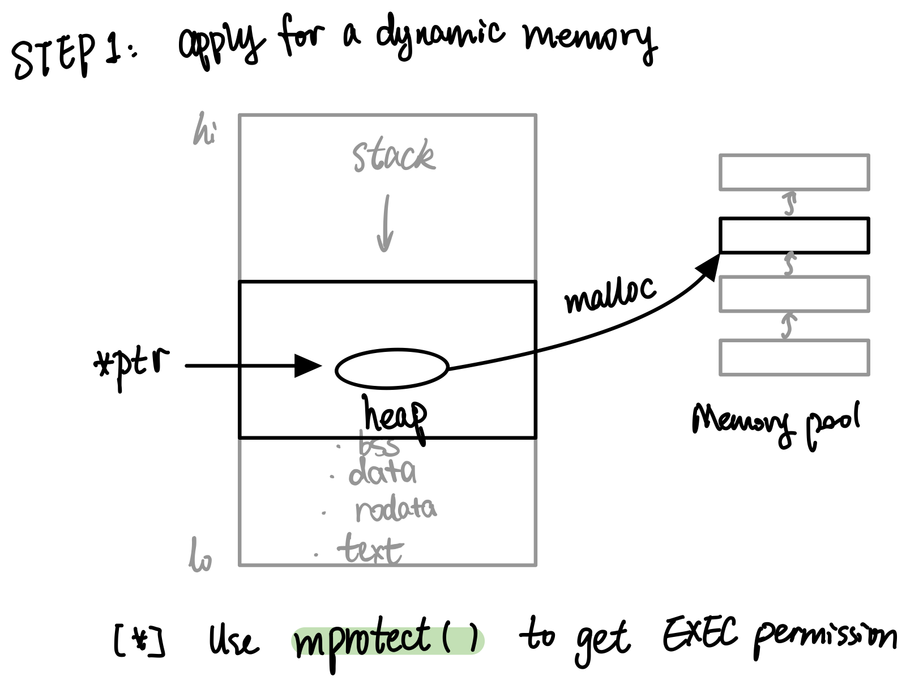
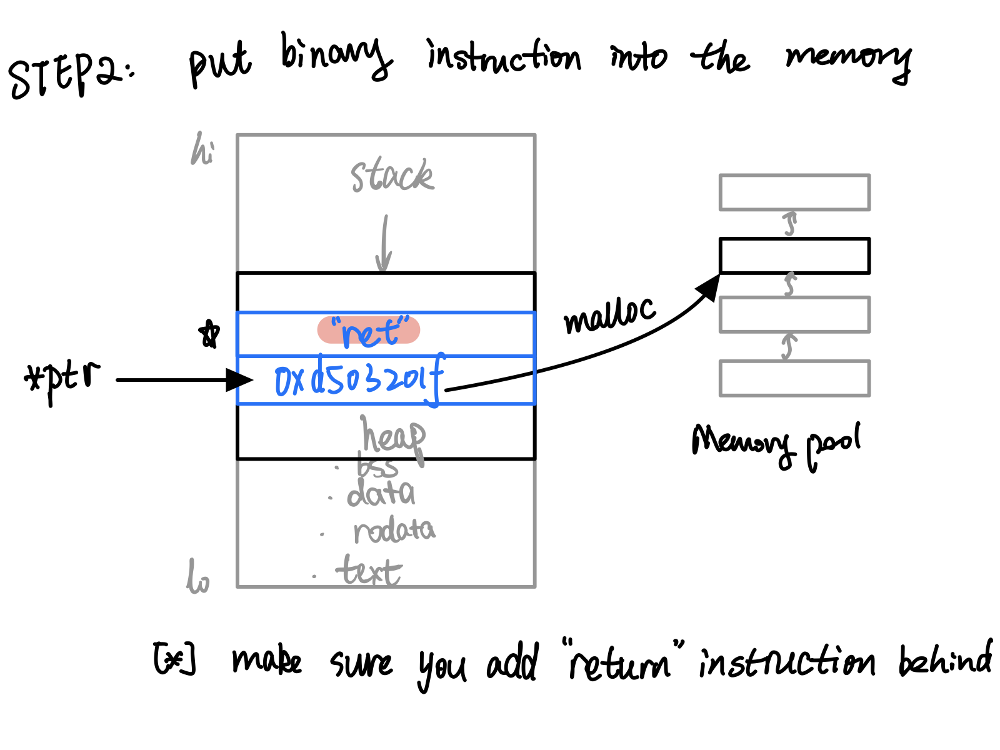
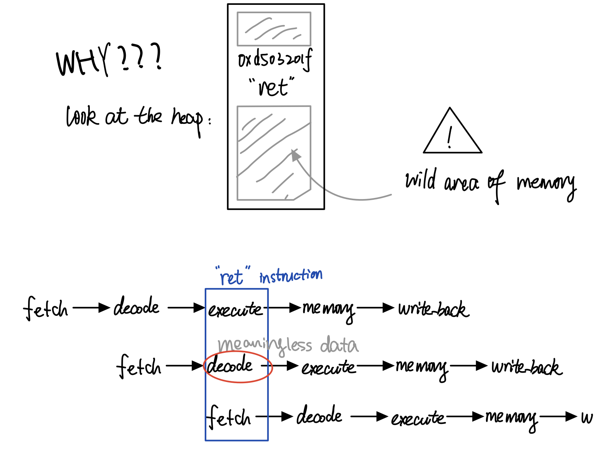
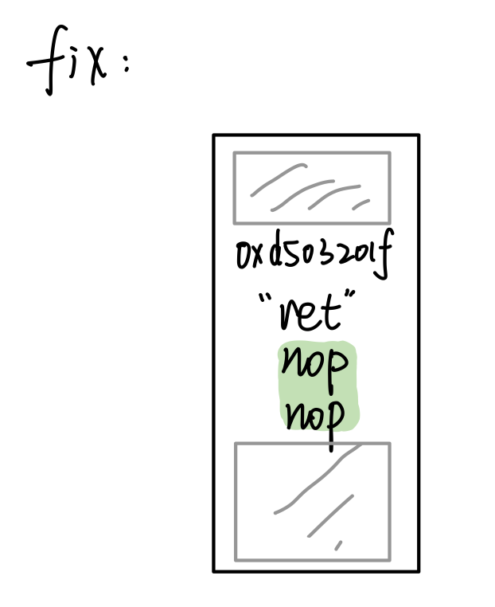
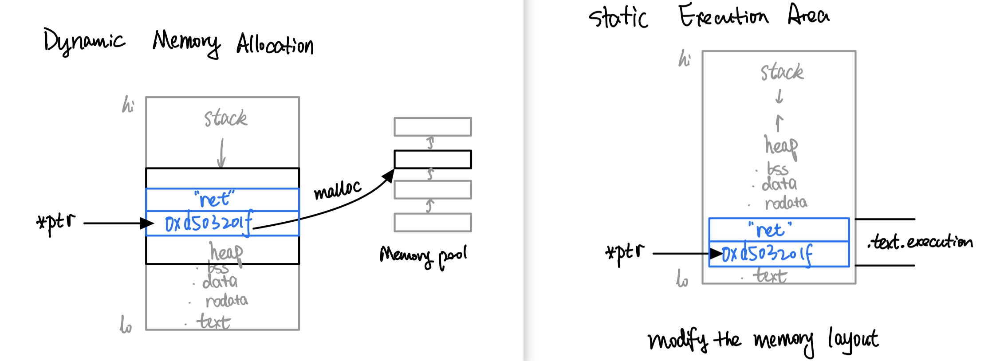
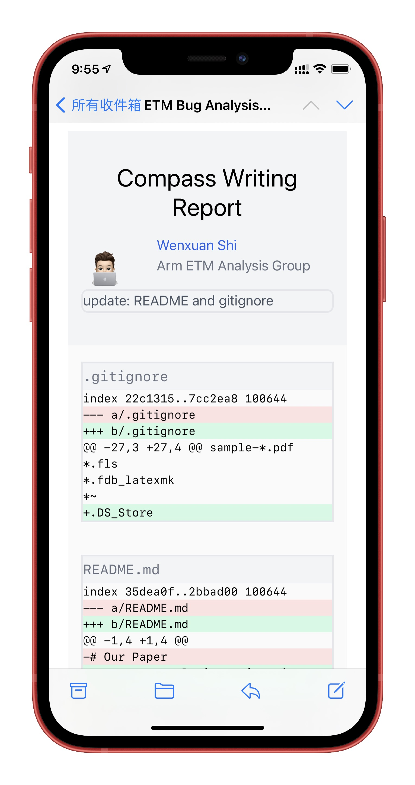
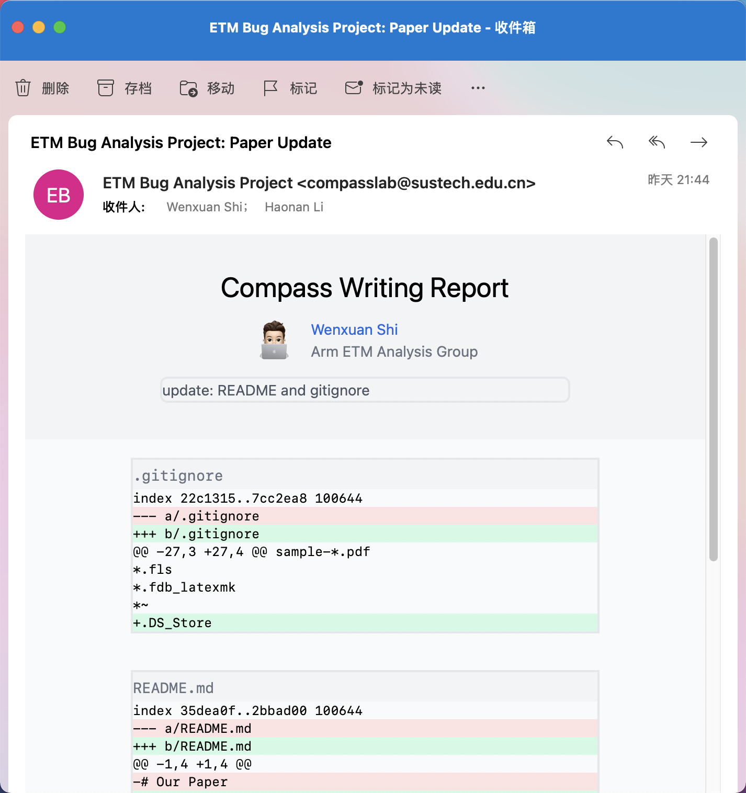

# Haonan

## Plan & Progress

- Improve the syscall capturing, supporting record for the parameter change

- Using `LD_PRELOAD` to hook library.

---

## Next week

- Improve the syscall capturing, supporting record for the parameter change

# Xueying

---

## Last Week's work

Took a TOEFL test.

---

## Next week's work

Use C++ to run a single assembly code from user input.

# Wenxuan

---

## Last week's plan

- [x] Use C++ to run a single assembly code from user input.

- [ ] Find an algorithm to replace branch instructions in the assembly code.


---

## Run assembly from user input

{height=90%}

---

## Run assembly from user input

{height=90%}

---

## Run assembly from user input

{height=20%}

### Make a function pointer

C style function pointer:

```c
void (*foo)(void) = (void (*)(void)) ptr;
```

In a normal C function, `sp (x29)` and `ra (x30)` are stored in the stack. We currently need to store that, too. But **eventually**, we will come up with an idea to maintain context.

### Invoke the function pointer
And then, try to execute:

```c
foo();
```

---

## Run assembly from user input

{height=90%}

---

## Run assembly from user input

{height=90%}

---

## Run assembly from user input

{height=90%}

---

## Memory Allocation

`mprotect()` can only change the permission of a certain **page** (coarse-grained). A better approach is to preserve a section in the memory at compile time using a **link script**.

{height=90%}

---

## One more thing: Switch from SVN to GIT

::: columns

:::: column

Looks well on mobile device.

{height=70%}

::::

:::: column

Looks great on desktop device.

*(Outlook, Mac Mail App)*

{height=80%}

::::

:::

---

## Next week's plan

- [ ] Create a new subprocess, find a way to overwrite its memory.

- [ ] Help writing the paper.

- [ ] Find an algorithm to replace branch instructions in the assembly code.
