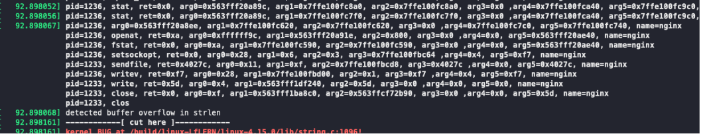

# Xueying

## Plan of Last Week

- help to write code

---

## This Week's Work

- Build the environment of ETM with the help with Yiming
- try ptrace() but failed.
  - pt_regs VS. user_pt_regs
  - PTRACE_ATTACH failed with unknowable reason
  - Use child process: find PC value failed. Find data failed.
- Many programs can be found that use ptrace() for code injection, but most of them are implemented under x86.

# Wenxuan

---

## Last week's plan

- [x] Group Project Defence (Week 8).

- [x] Use `ptrace()` to create a subprocess restored from coredump.

- [x] Help writing the paper.

---

## Environment Sync

Great thanks to Yiming for his very detailed documentation!

---

## Evaluation: Non-concurrency Bug

### curl-721

https://github.com/HiiragiKano/bugbase/tree/master/data/curl-721

### cppcheck-148

https://github.com/HiiragiKano/bugbase/tree/master/data/cppcheck-148

### cppcheck-152

https://github.com/HiiragiKano/bugbase/tree/master/data/cppcheck-152

---

## Replay Machine

Continue on playing the `ptrace`.

Modify the memory sections of subprocess. Ref: code injection.

Very useful documentation:

[Use ptrace to modify memory: obtain process code injection](https://blog.csdn.net/u011580175/article/details/82831889)

---

## Next week's plan

- [ ] Trace three buggy programs, and analyse the output.
- [ ] Decode coredump and extract useful memory layout. Use `ptrace` to restore the memory layout in a new process.

# Haonan

---

## Plan of Last Week

- Pass the midterm defence *casually*
- Finish my syscall capturing
- Discuss with outher teammates

---

## Actual Progress

- What I did for last three days?
  - Apr 3: change to file writes, made small tests
  - Apr 4: add locks for file writes, write a data structure
  - Apr 5: finish data structure, but meet many bugs....
- Finish syscall capturing *(almost)*
  - communicate between user space with kernel space
  - a data structure to save **syscall number** and **arg0**
  - \textcolor{BurntOrange}{figure out why crash in a \textit{strange} way}
  - \textcolor{BurntOrange}{specific handlers for different syscalls}
- Meeting
  - decided which parts in papar writing

---

## Kernel-User Communication

- A not recommended manner: write file in kernel (\textcolor{gray}{\textit{but it works}})
- ref: [an excellent article](https://www.linuxjournal.com/article/8110)
- Why not recommand?
  - If failed, the kernel may crash, or brings some security risk
  - Other engineering issues...

- Why did I choose it?
  - simple, shared memory is complex: 
    - make a piece of memory; 
    - while dumping to files, the kenrel still write to buffer
    - sysdig doesn't ensure its complement (record data may loss)
  - lightweight, with ~1% overhead

---

## Crash

A very very long string, after change of string format

{width=110%}

---

## Wite different handlers for different syscalls

- 32 different syscalls from Yiming's record
- for syscalls like `getrandom(void *buf, size_t buflen, unsigned int flags)`, it needs to output the entire `buf`

---

## Record Complement

- sysdig will *try* to move data from buffer, but if data production is much faster, it will simply **overwrite** the previous record...
- in our settings, `write_to_file` will block the record
{width=100%}

---

## Plan for Next Week

- **Really** finish my syscall capturing
- Paper writing: overview and design
