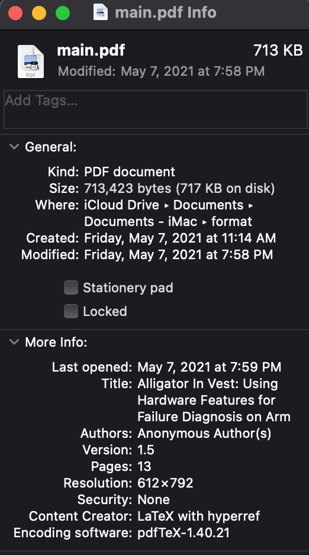
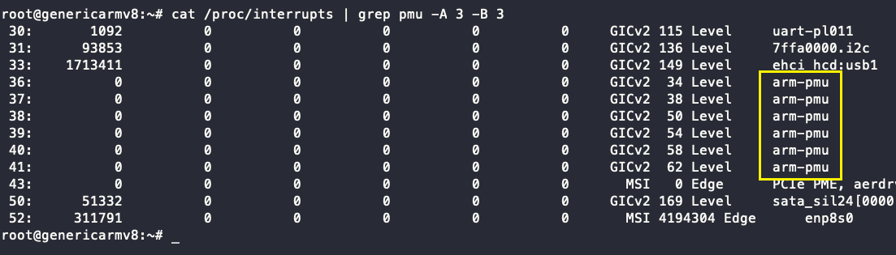
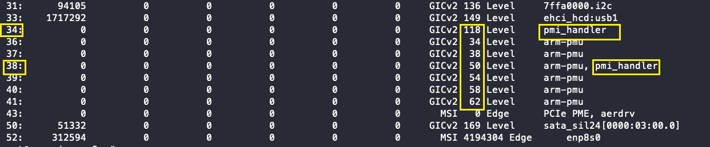
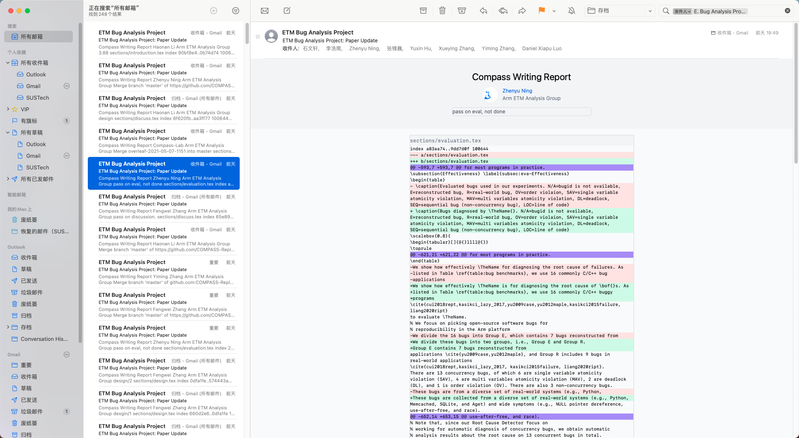
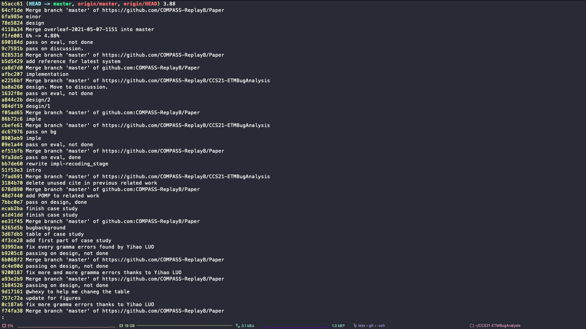
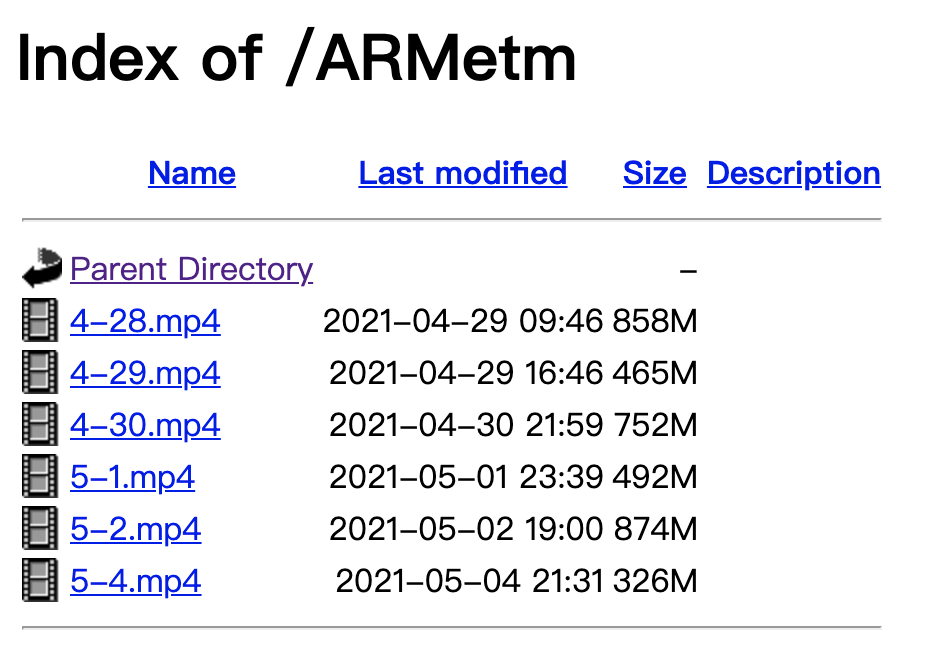
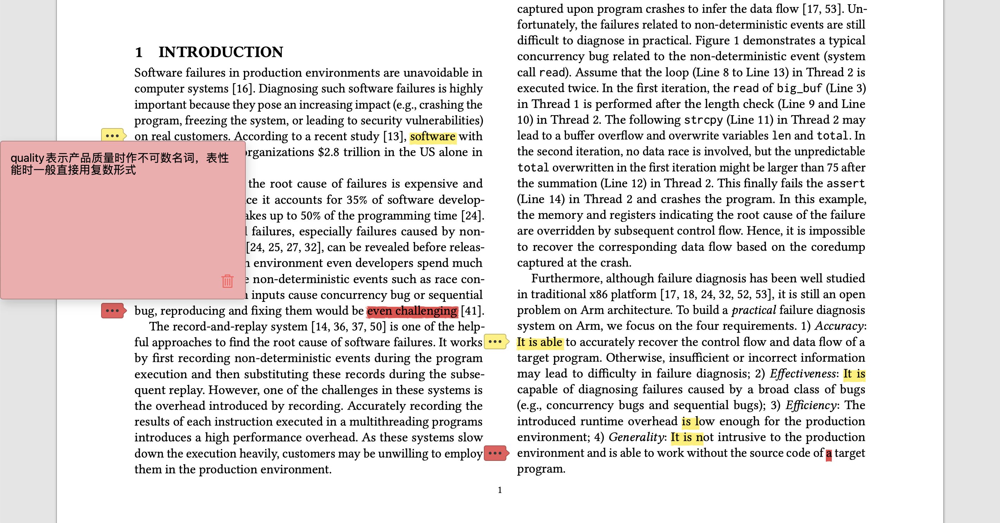

# Haonan

## Plan of Last Week

-  Do our best to make Zhenyu spend a happy holiday

---

## Progress

- Completely missed, Zhenyu had an **unforgettable** holiday (20 days continuous work, from Apr. 19 to May 8) 

---

## Syscall Capturer: Syscord

- key problem: \textsc{Syscord} introduces 10% overhead 
  - 2~3% on x86, juno with debian, and raspberry pi.
  - 10% on juno with open embedded (ETM available ONLY on OE)
- finding the bottomneck by comment each part of code (May. 5)
  - we found the bottomneck is `sprintf`/`strncpy`, which introduces 7%  overhead...
  - replace `strncpy` with `memcpy`, and implement `sprintf` as our own version (*Reinventing the wheel*), reduce the overhead to 6%

### Communication with Lei Zhou
Lei: You must have called some Linux API somewhere

I: No, that's impossible, I barely call any API

*(half a day latter...)*

I: Oh... I call `sprintf`... it looks like the reason

---

## On Juno: The large scale of test, the lower overhead

| Size    | baseline | syscord       |
| ------- | -------- | ------------- |
| 5,000   | 0.68     | 0.85 (+24.3%) |
| 50,000  | 7.642    | 8.40 (+12%)   |
| 500,000 | 88.94    | 90.09 (+1.3%) |
Table: test on different number of requests for nginx

But we don't find the same trend on other platforms...

---

## Paper writing: an overloaded week (or 3 days)...


\color{orange} Average: 10 commits a day. \color{blue} Last three hours: 14, 10, 22 commits

---

::: columns

:::: {.column width="30%"}

{height=70%}

::::

:::: {.column width="60%"}

\vspace{50pt}
- generate the final version at 7:58 PM
- impossible to pass it again...
- many mistakes on it, such as writing *processor* as *professor*...
- maybe for next time, we need set up an earlier deadline for final draft.
::::

:::

---

## Other feelings...

- Communication, exchanges, synchronization
  - I have been focusing on my part until the last week.
  - We should have more meetings, especially for remote collaboration
- Very very very thanks to Zhenyu:
  - He definitely contributed the most

### Communication with Zhenyu
I: maybe you need to directly write some part, instead of giving suggestions.

Zhenyu: No, never. This is your paper.

*(time flies to May 6 & 7)*

Zhenyu: I have changed your motivation example, what do you think about it?

---

## Plan for Next Week

- Write some random words for my graduation project. (deadline: May 14)'
- Determine what the next of our project, make more improvement?
- Prepare for apper sharing: Mozilla's rr (**NOT for next week**)


# Wenxuan

---

## Last Week's work

- Evaluation of non-concurrency bugs
- Revise the paper
- \[EXTRA\] Handle PMU interrupt in kernel

---

## Handle PMU interrupt in kernel

ETM output should be moved out from the buffer periodically. That means we
should handle the interrupt in the kernel.

Use `request_irq()` to register a user-defined handler for a certain interrupt.

```c
int request_irq(unsigned int irq, irq_handler_t handler,
unsigned long irqflags, const char *devname, void *dev_id)
```

---

## A carefully look into `request_irq`

```c
int request_irq(unsigned int irq, irq_handler_t handler,
unsigned long irqflags, const char *devname, void *dev_id)
```

| argument | meaning                                     |
| -------- | ------------------------------------------- |
| irq      | the interrupt id                            |
| handler  | a function pointer, `int (*func_ptr)(void)` |
| devname  | a string, the name of your device           |
| dev_id   | a magic number                              |

### dev_id
`void *dev_id` is used to identify the device handling the interrupt. For
example, if you want to delete the interrupt handler:

```c
void remove_irq(unsigned int irq, void *dev_id);
```

---

## Handle PMU interrupt
```
int request_irq(unsigned int irq, irq_handler_t handler,
unsigned long irqflags, const char *devname, void *dev_id)
```

\vspace{20pt}

It should have been easy if we wrote a kernel module like this:

```c
static const unsigned int pmu_irqs[]
    = { PMI_A72_core0, PMI_A72_core1, ..., };

for (irq_i = 0; irq_i < 6; irq_i++) {
    request_irq(pmu_irqs[irq_i], pmu_irq_handler, 
    IRQF_DEFAULT, "my_handler", (void*)pmu_irq_handler);
}
```

---

## Linux default handler

Linux uses the PMU as performance counter (`perf` tools), so it already has a
handler for PMIs.

You can see them with `cat /proc/interrupts`



And... They are set to **NON_SHAREABLE**.

---

## Replace the default handler with ours

### PLAN A
```c
void remove_irq(unsigned int irq, void *dev_id)
```
We know the `irq`, but I don't know the `dev_id`! By checking the linux source,
I found that the `dev_id` is a memory reference dynamically generated when the
linux boots!

. . .

### PLAN B
Change the default handler by modifing the linux kernel. Stop registering it, or
add SHAREABLE flags to it.

---

## Logic interrupt ID vs Hardware interrupt ID

I found the result is still odd...



There exists another **mapping** between hardware interrupt id and kernel
interrupt id! (It's not simply adding a number or something. It's a complex map)

The interrupt id for PMI in Linux is 36, 37, 38, 39, 40, 41.

---

Tips on writing and revising a paper

---

## Tips on writing and revising a paper

- How to quickly check the grammar errors in a paper.
- How to use Git to sync paper writing and sending emails automatically.

---

## How to quickly check grammar errors

### Grammarly

[Grammarly](https://www.grammarly.com/) is a great tool to check grammar errors.
However, it dislikes passive voice, we should not trust every results it gives
out.

. . .

### Copy text from PDF

Copy and paste in a PDF file is painful! You have to handle break-lines,
dislocated characters, and so many other things!

To quickly copy lines in paper, first change the first line in LaTeX

```latex
\documentclass[manuscript, anonymous]{acmart}
```

and use the command line tool `pdftotext`.

---

## How to use Git and send emails automatically

Use the Git Action I create [=>GitAction](https://github.com/COMPASS-ReplayB/CCS21-ETMBugAnalysis/blob/master/.github/workflows/blank.yml)

---

What makes a paper

---

## What makes a paper

We fill the email inbox with 65 mails in one day.



---

## What makes a paper

We push 381 versions of paper to Git.



---

## What makes a paper

### **04:40:36** (Wed Apr 21)

Yiming made the `nightest' edit in a day

### **08:20:35** (Tue Apr 20)

Haonan made the `earliest' edit in a day

---

## What makes a paper

| Name    | \# of commits | add lines | delete lines |
| ------- | ------------- | --------- | ------------ |
| Yiming  | 115           | +5455     | -2877        |
| Haonan  | 110           | +3858     | -3013        |
| Yuxin   | 26            | +763      | -593         |
| Wenxuan | 35            | +896      | -1590        |
| Xueying | 20            | +760      | -461         |
| Fengwei | 21            | +144      | -129         |
| Zhenyu  | 40            | +2023     | -949         |

---

## Special Thanks to Zhenyu

6 meetings. Add up to 22 hours.

| Meeting Time   | Apr 28 | Apr 29 | Apr 30 | May 1 | May 2 | May 4 |
| -------------- | ------ | ------ | ------ | ----- | ----- | ----- |
| Meeting Length | 5:09   | 3:08   | 4:28   | 3:02  | 4:50  | 1:33  |

{height=40%}

---

## Special Thanks to Jingting, Yihao

They gave us much advice.



## Special Thanks to some one

who gave up the vacation to be with me and supported me in the midst of
depression, self-doubting and pain :)

---

## Next week's plan

Replay machine!

# Xueying

---

## self-examination

1. Didn't work hard enough
2. Be an active learner
3. Be confident

---

## Thanks 

I am extremely grateful to all my teammates and Zhenyu.

I had learned a lot from this experience.
